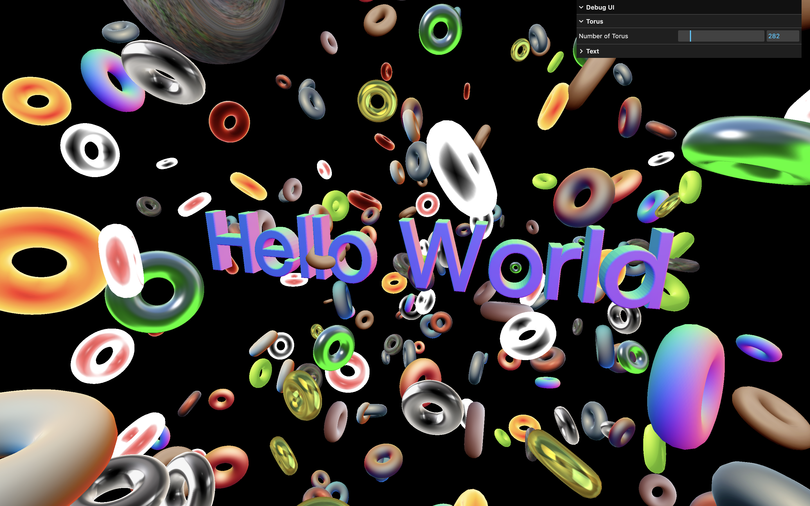
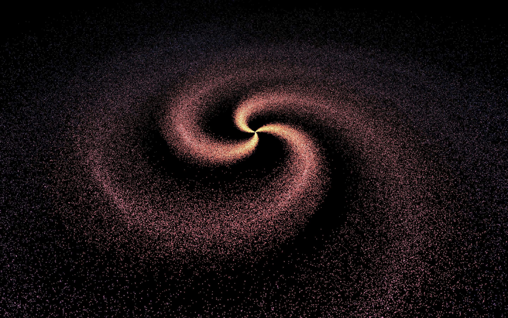
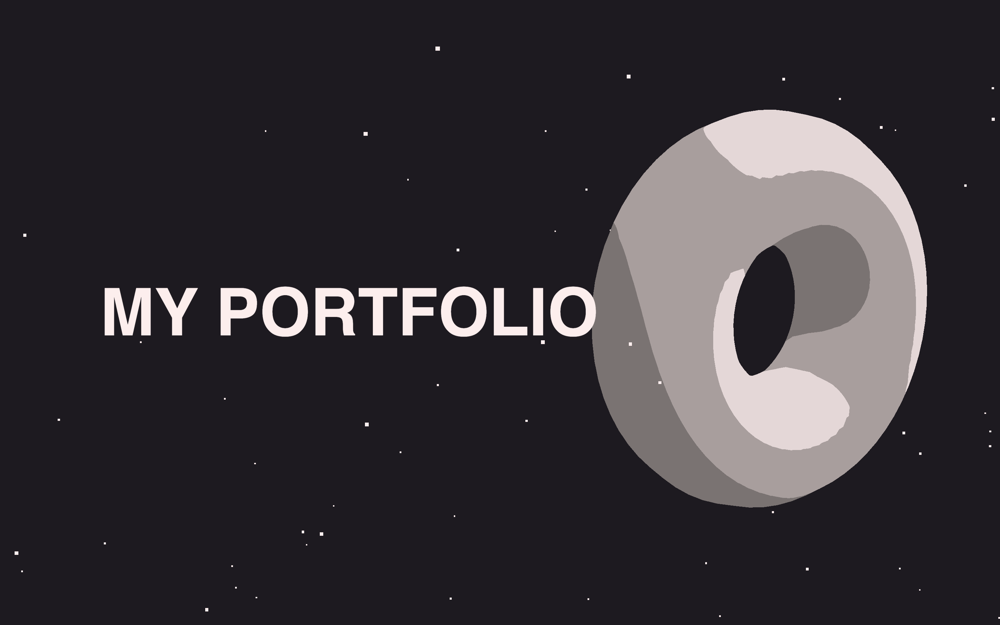
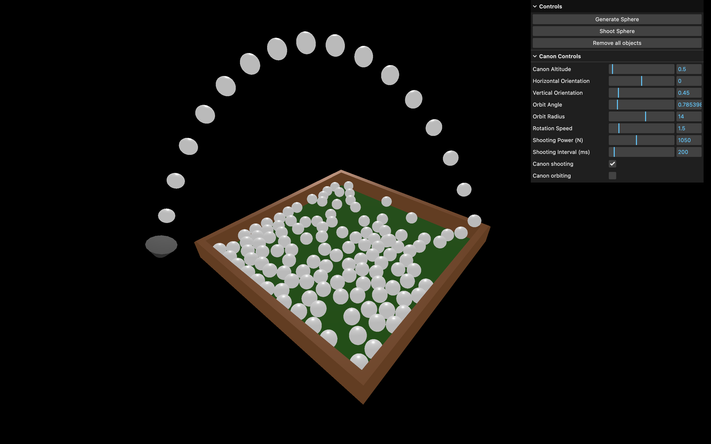

# 🧩 Three.js – Transform Objects & Text 3D

Une scène 3D interactive réalisée avec [Three.js](https://threejs.org/), inspirée du parcours Three.js Journey par Bruno Simon.



## 🚀 Démo

[Voir la démo](https://rekuiem84.github.io/threejs-journey/)

## ✨ Fonctionnalités

- Génération dynamique de tores (torus) (avec menu de debug accessible avec la touche `H`)
- Texte 3D personnalisable (édition via le menu de debug)
- Matériaux Matcap pour un rendu stylisé
- Contrôles de caméra interactifs (OrbitControls)
- Interface de debug (lil-gui) pour ajuster les paramètres en temps réel

## 🛠️ Installation & Lancement

1. **Cloner le dépôt :**

   ```bash
   git clone https://github.com/Rekuiem84/threejs-journey
   cd threejs-journey
   ```

2. **Installer les dépendances :**

   ```bash
   npm install
   ```

3. **Lancer le serveur :**

   ```bash
   npm run dev
   ```

4. **Build pour la production :**

   ```bash
   npm run build
   ```

   Les fichiers optimisés seront générés dans le dossier `dist/`.

## 📁 Structure du projet

```
├── src/           # Fichiers sources
├── static/        # Textures, polices et assets statiques (matcaps et autres)
├── dist/          # Fichiers générés pour la production
├── package.json   # Dépendances et scripts
└── vite.config.js # Configuration Vite
```

## 🖼️ Textures

Les textures matcaps utilisées proviennent de [ce repo](https://github.com/nidorx/matcaps) et sont stockées dans le dossier [`static/`](static/)

## 🔗 Mes autres projets Three.js

<table>
  <thead>
    <tr>
      <th>Projet</th>
      <th>Démo</th>
      <th>Description</th>
      <th>Aperçu</th>
    </tr>
  </thead>
  <tbody>
    <tr>
      <td><a href="https://github.com/rekuiem84/haunted-house-threejs/">Maison hantée</a></td>
      <td align="center"><a href="https://rekuiem84.github.io/haunted-house-threejs/">Voir</a></td>
      <td>Maison hantée interactive avec lumières, brouillard et feux follets animés</td>
      <td></td>
    </tr>
    <tr>
      <td><a href="https://github.com/rekuiem84/galaxy-generator/">Générateur de galaxie</a></td>
      <td align="center"><a href="https://rekuiem84.github.io/galaxy-generator/">Voir</a></td>
      <td>Générateur de galaxie avec de nombreux éléments paramétrables</td>
      <td></td>
    </tr>
    <tr>
      <td><a href="https://github.com/rekuiem84/scroll-animation-threejs/">Portfolio 3D</a></td>
      <td align="center"><a href="https://rekuiem84.github.io/scroll-animation-threejs/">Voir</a></td>
      <td>Portfolio 3D d'exemple avec des objets animés</td>
      <td></td>
    </tr>
    <tr>
      <td><a href="https://github.com/Rekuiem84/basic-physics-threejs">Simulateur physique</a></td>
      <td align="center"><a href="https://rekuiem84.github.io/basic-physics-threejs/">Voir</a></td>
      <td>Simulateur de physique 3D avec un canon</td>
      <td></td>
    </tr>
  </tbody>
</table>
