# 🧩 Three.js – Transform Objects & Text 3D

Une scène 3D interactive réalisée avec [Three.js](https://threejs.org/), inspirée du parcours Three.js Journey par Bruno Simon.

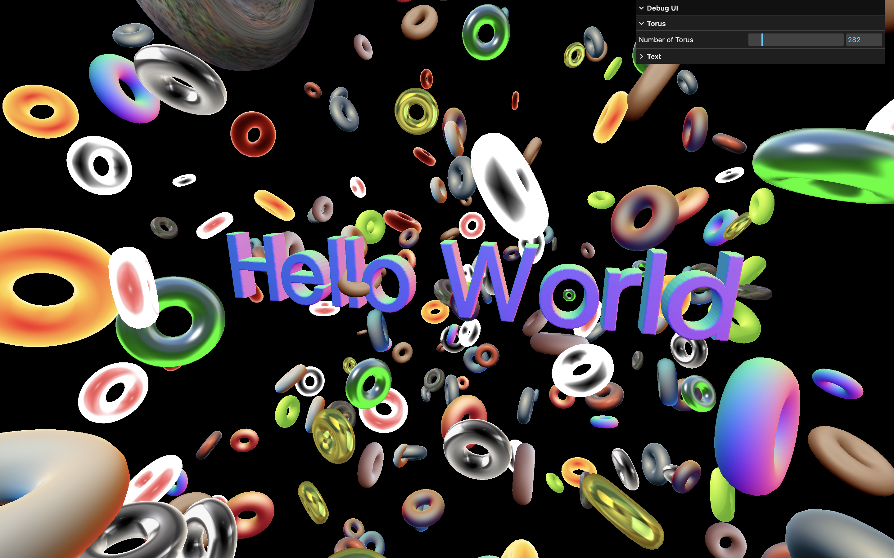

## 🚀 Démo

[Voir la démo](https://rekuiem84.github.io/threejs-journey/)

## ✨ Fonctionnalités

- Génération dynamique de tores (torus) (avec menu de debug accessible avec la touche `H`)
- Texte 3D personnalisable (édition via le menu de debug)
- Matériaux Matcap pour un rendu stylisé
- Contrôles de caméra interactifs (OrbitControls)
- Interface de debug (lil-gui) pour ajuster les paramètres en temps réel

## 🛠️ Installation & Lancement

1. **Cloner le dépôt :**

   ```bash
   git clone https://github.com/Rekuiem84/threejs-journey
   cd threejs-journey
   ```

2. **Installer les dépendances :**

   ```bash
   npm install
   ```

3. **Lancer le serveur :**

   ```bash
   npm run dev
   ```

4. **Build pour la production :**

   ```bash
   npm run build
   ```

   Les fichiers optimisés seront générés dans le dossier `dist/`.

## 📁 Structure du projet

```
├── src/           # Fichiers sources
├── static/        # Textures, polices et assets statiques (matcaps et autres)
├── dist/          # Fichiers générés pour la production
├── package.json   # Dépendances et scripts
└── vite.config.js # Configuration Vite
```

## 🖼️ Textures

Les textures matcaps utilisées proviennent de [ce repo](https://github.com/nidorx/matcaps) et sont stockées dans le dossier [`static/`](static/)

## 🔗 Mes autres projets Three.js

<table>
  <thead>
    <tr>
      <th>Projet</th>
      <th>Démo</th>
      <th>Description</th>
      <th>Aperçu</th>
    </tr>
  </thead>
  <tbody>
    <tr>
      <td><a href="https://github.com/rekuiem84/haunted-house-threejs/">Maison hantée</a></td>
      <td align="center"><a href="https://rekuiem84.github.io/haunted-house-threejs/">Voir</a></td>
      <td>Maison hantée interactive avec lumières, brouillard et feux follets animés</td>
      <td></td>
    </tr>
    <tr>
      <td><a href="https://github.com/rekuiem84/galaxy-generator/">Générateur de galaxie</a></td>
      <td align="center"><a href="https://rekuiem84.github.io/galaxy-generator/">Voir</a></td>
      <td>Générateur de galaxie avec de nombreux éléments paramétrables</td>
      <td>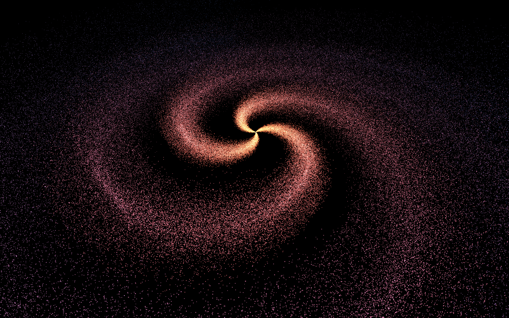</td>
    </tr>
    <tr>
      <td><a href="https://github.com/rekuiem84/scroll-animation-threejs/">Portfolio 3D</a></td>
      <td align="center"><a href="https://rekuiem84.github.io/scroll-animation-threejs/">Voir</a></td>
      <td>Portfolio 3D d'exemple avec des objets animés</td>
      <td>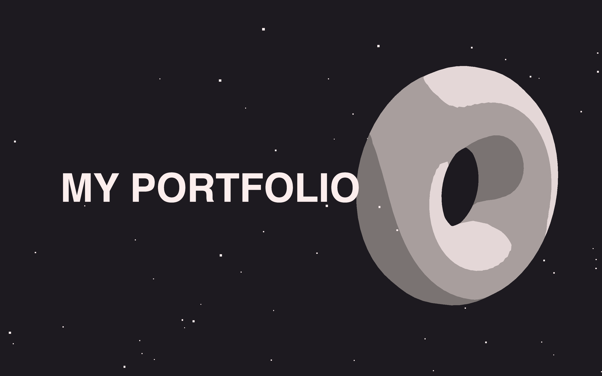</td>
    </tr>
    <tr>
      <td><a href="https://github.com/Rekuiem84/basic-physics-threejs">Simulateur physique</a></td>
      <td align="center"><a href="https://rekuiem84.github.io/basic-physics-threejs/">Voir</a></td>
      <td>Simulateur de physique 3D avec un canon</td>
      <td>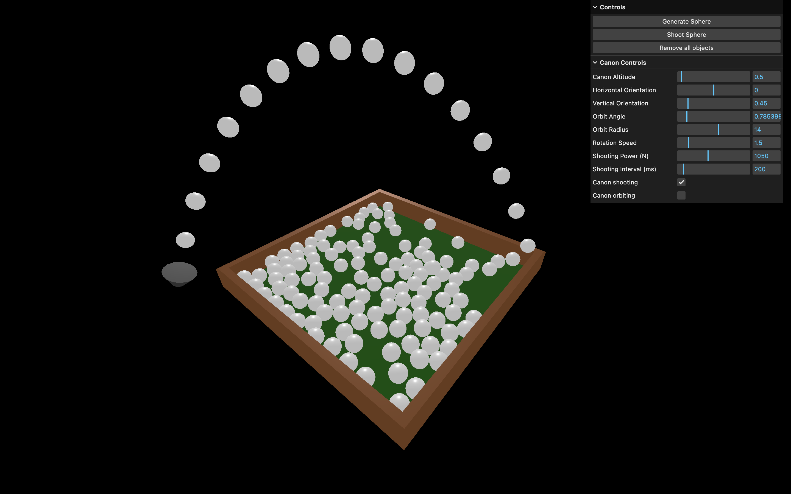</td>
    </tr>
    <tr>
      <td><a href="https://github.com/Rekuiem84/3d-models-showcase">Modèles 3D importés</a></td>
      <td align="center"><a href="https://rekuiem84.github.io/3d-models-showcase/">Voir</a></td>
      <td>Visualiser des modèles 3D complèxes</td>
      <td>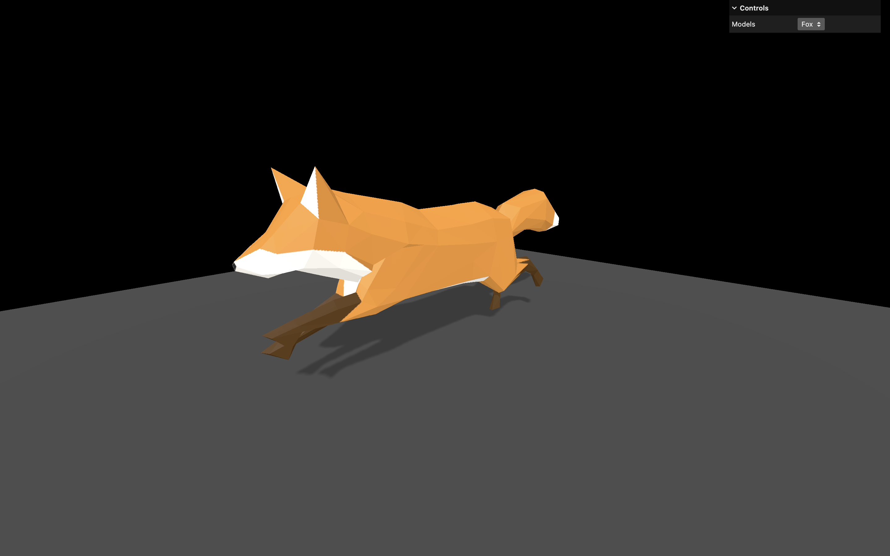</td>
    </tr>
    <tr>
      <td><a href="https://github.com/Rekuiem84/shaders">Shaders</a></td>
      <td align="center"><a href="https://rekuiem84.github.io/shaders/">Voir</a></td>
      <td>Shader de drapeau flottant</td>
      <td>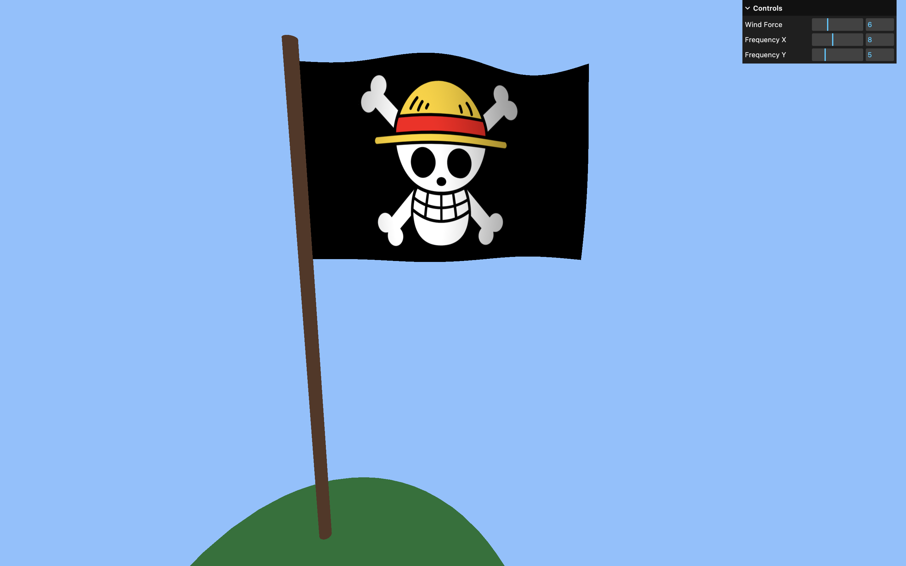</td>
    </tr>
    <tr>
      <td><a href="https://github.com/Rekuiem84/shader-patterns">Shader patterns</a></td>
      <td align="center"><a href="https://rekuiem84.github.io/shader-patterns/">Voir</a></td>
      <td>Customisation d'un shader avec le bruit de Perlin</td>
      <td>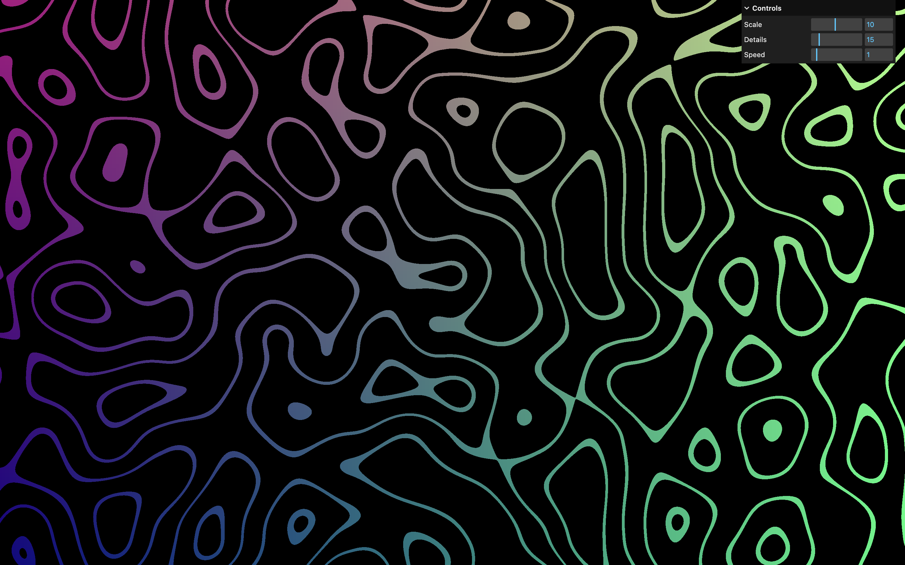</td>
    </tr>
    <tr>
      <td><a href="https://github.com/Rekuiem84/raging-sea">Mer agitée</a></td>
      <td align="center"><a href="https://rekuiem84.github.io/raging-sea/">Voir</a></td>
      <td>Shader custom de vagues dans une mer agitée</td>
      <td>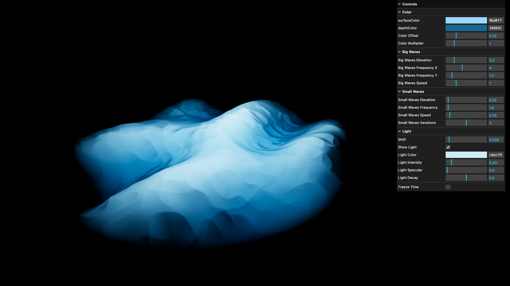</td>
    </tr>
    <tr>
      <td><a href="https://github.com/Rekuiem84/modified-model-materials">Shader Déformation</a></td>
      <td align="center"><a href="https://rekuiem84.github.io/modified-model-materials/">Voir</a></td>
      <td>Modification du material shader d'un model</td>
      <td>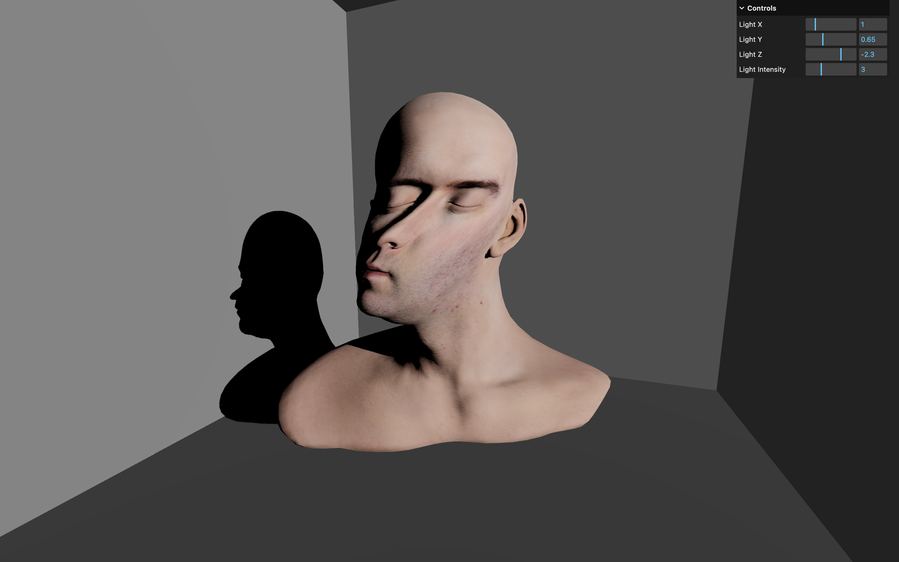</td>
    </tr>
    <tr>
      <td><a href="https://github.com/Rekuiem84/coffee-smoke-shader">Smoking Hot Coffee</a></td>
      <td align="center"><a href="https://rekuiem84.github.io/coffee-smoke-shader/">Voir</a></td>
      <td>Shader de fumée d'un café chaud</td>
      <td>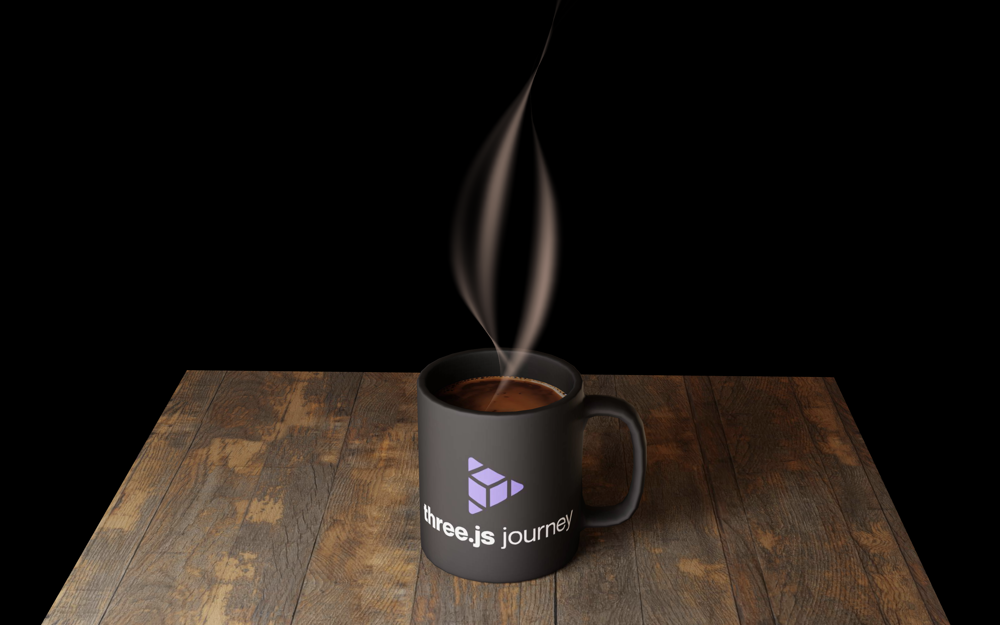</td>
    </tr>
    <tr>
      <td><a href="https://github.com/Rekuiem84/hologram-shader">Hologramme</a></td>
      <td align="center"><a href="https://rekuiem84.github.io/hologram-shader/">Voir</a></td>
      <td>Objets holographiques</td>
      <td>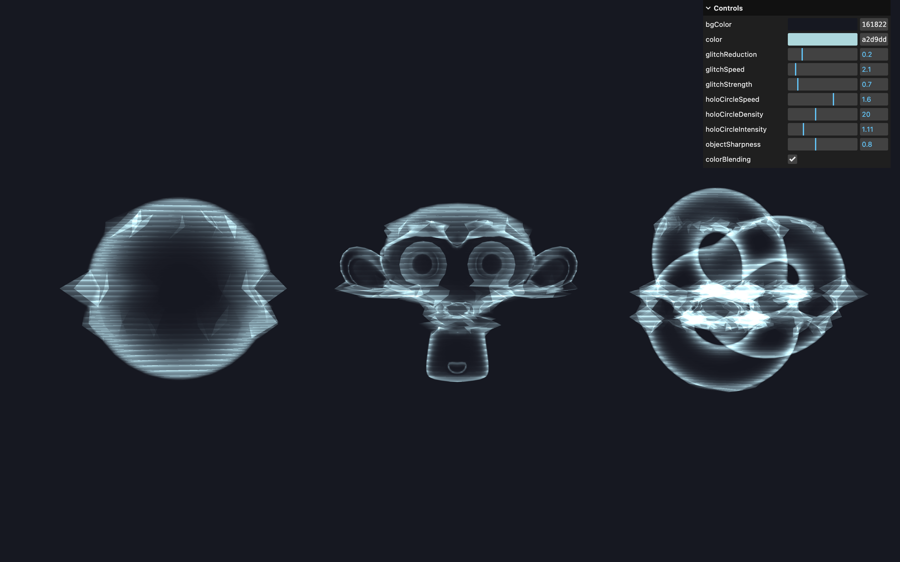</td>
    </tr>
    <tr>
      <td><a href="https://github.com/Rekuiem84/fireworks-shaders">Feux d'artifices</a></td>
      <td align="center"><a href="https://rekuiem84.github.io/fireworks-shaders/">Voir</a></td>
      <td>Shader de feux d'artifices intéractifs</td>
      <td>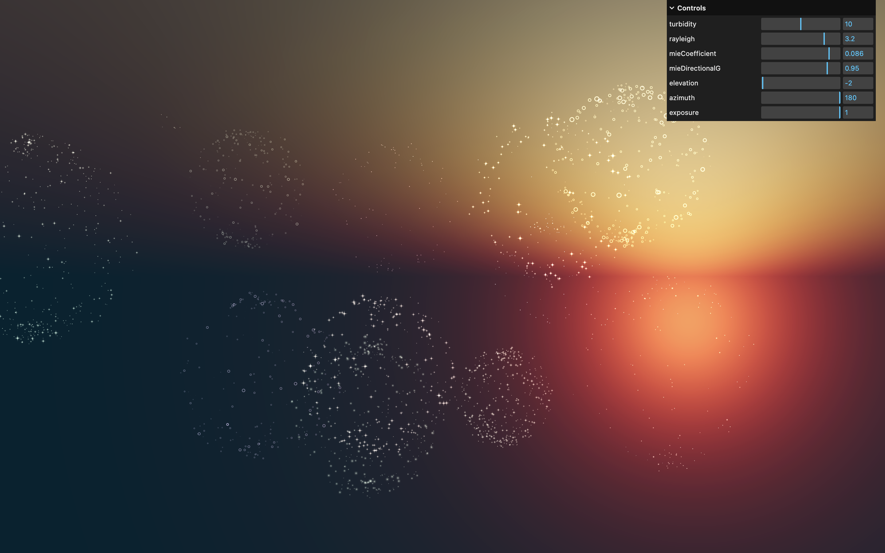</td>
    </tr>
    <tr>
      <td><a href="https://github.com/Rekuiem84/lights-shading-shaders">Lumières et shading</a></td>
      <td align="center"><a href="https://rekuiem84.github.io/lights-shading-shaders/">Voir</a></td>
      <td>Shader de lumières custom</td>
      <td>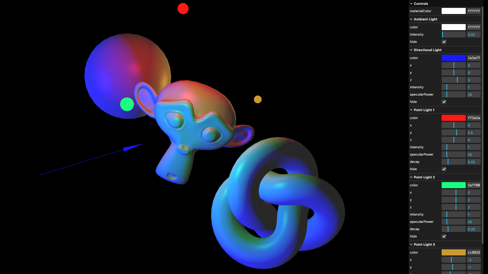</td>
    </tr>
    <tr>
      <td><a href="https://github.com/Rekuiem84/halftone-shading">Halftone shader</a></td>
      <td align="center"><a href="https://rekuiem84.github.io/halftone-shading/">Voir</a></td>
      <td>Shader de halftone, effet trame de BD</td>
      <td>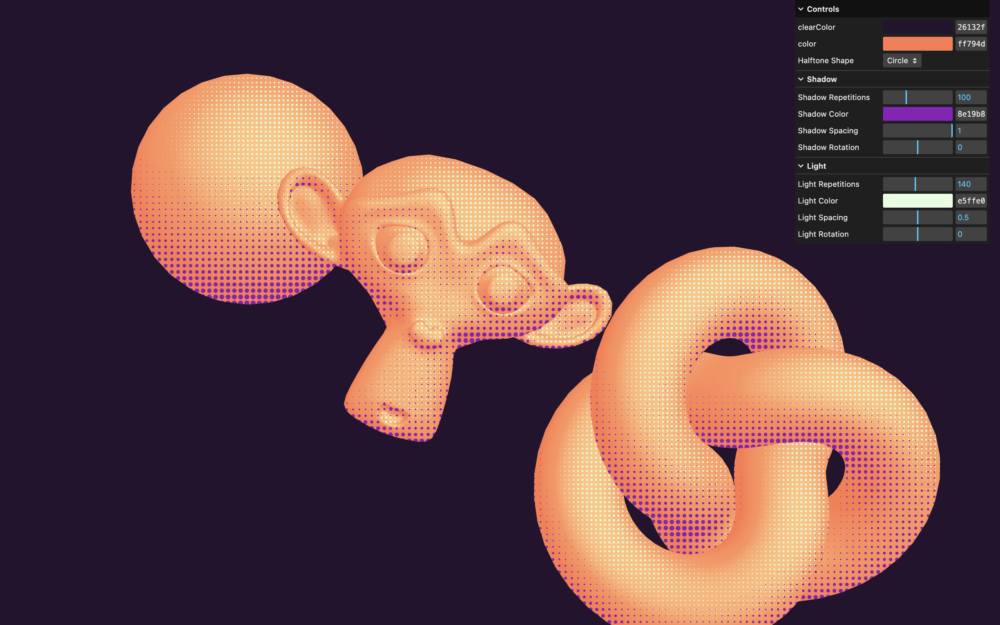</td>
    </tr>
    <tr>
      <td><a href="https://github.com/Rekuiem84/earth-shaders">Terre et atmosphère</a></td>
      <td align="center"><a href="https://rekuiem84.github.io/earth-shaders/">Voir</a></td>
      <td>Shader réaliste de la terre avec son atmosphère réagissant aux réflections du soleil</td>
      <td>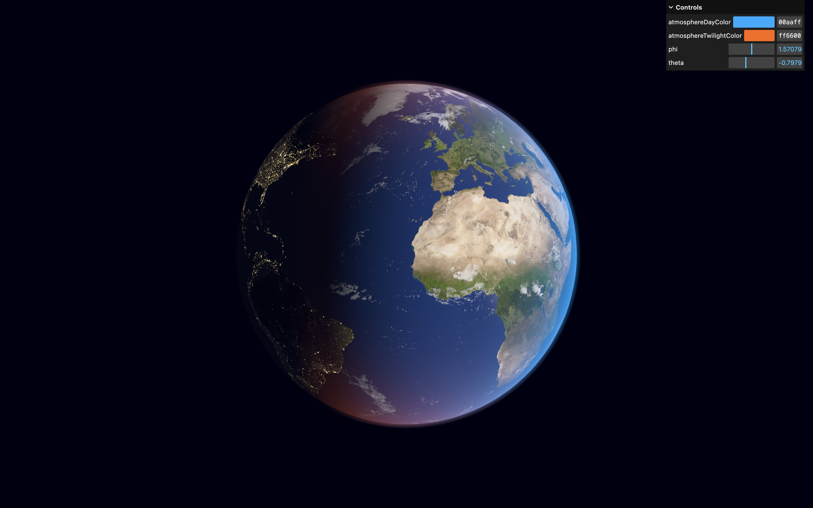</td>
    </tr>
    <tr>
      <td><a href="https://github.com/Rekuiem84/cursor-particles-shader">Particules réactives</a></td>
      <td align="center"><a href="https://rekuiem84.github.io/cursor-particles-shader/">Voir</a></td>
      <td>Shader de particules réactives au curseur, depuis une image source</td>
      <td>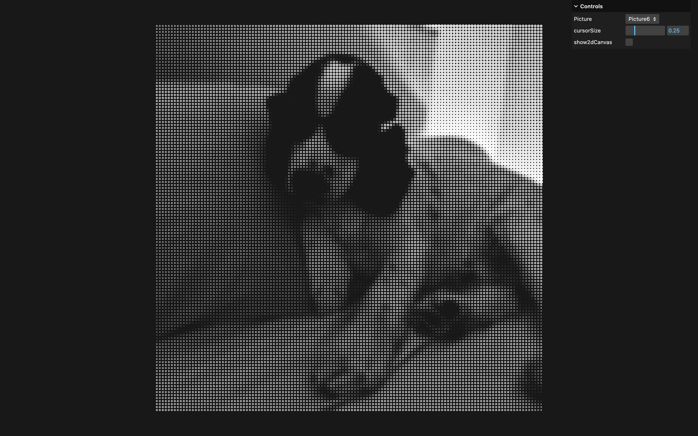</td>
    </tr>
    <tr>
      <td><a href="https://github.com/Rekuiem84/particles-morphing-shader">Morphing de particules</a></td>
      <td align="center"><a href="https://rekuiem84.github.io/particles-morphing-shader/">Voir</a></td>
      <td>Morphing entre 2 modèles via des particules de leurs vertices</td>
      <td></td>
    </tr>
    <tr>
      <td><a href="https://github.com/Rekuiem84/flow-field-particles-shaders">FlowField de particules</a></td>
      <td align="center"><a href="https://rekuiem84.github.io/flow-field-particles-shaders/">Voir</a></td>
      <td>Effet de flowfield sur les particules, avec calcul depuis un GPGPU</td>
      <td>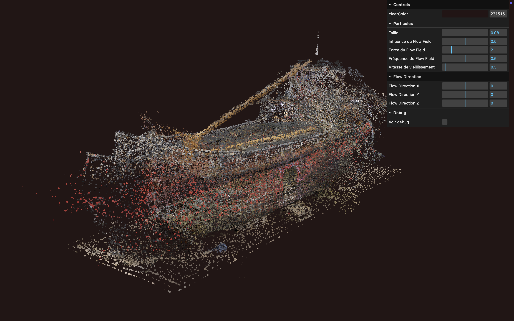</td>
    </tr>
  </tbody>
</table>
